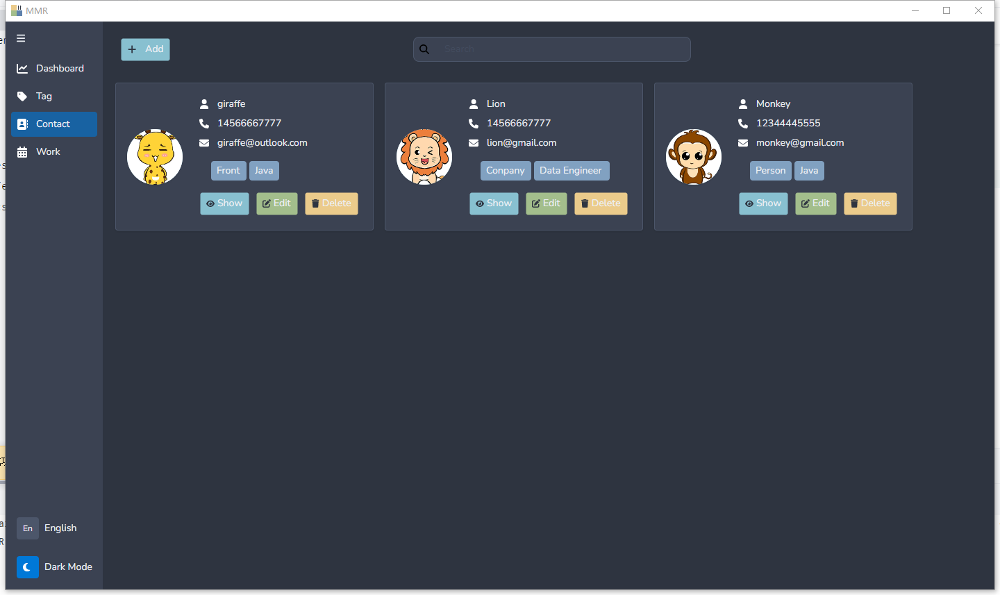

# MMR(My Money Record)

    

一个简单高效的个人项目账务跟踪应用，帮助你轻松管理个人项目的收支明细。

## 预览

    

    

## 特性

- 📝 交易记录：方便记录项目的每一笔收入支出
- 💰 借贷管理：清晰追踪与他人的借贷往来
- 📊 数据统计：直观展示收支情况和借贷状态
- 📱 跨平台：支持 Windows、macOS 和 Linux
- 🎨 现代界面：基于 Avalonia UI 的精美界面设计
- 🌓 主题切换：支持浅色/深色模式，集成 Nord 主题
- 🌍 国际化：支持中英双语切换
- 🧩 模块化：基于依赖注入的松耦合架构

## 技术栈

- 框架：.NET 8
- UI框架：Avalonia UI 11
- 架构模式：MVVM
- 数据存储：SQLite/Entity Framework Core
- 依赖注入：Microsoft.Extensions.DependencyInjection
- 主题：Nord Theme
- 国际化：内置资源文件

### 环境要求

- .NET 8 SDK
- Visual Studio 2022 或 JetBrains Rider（推荐）
